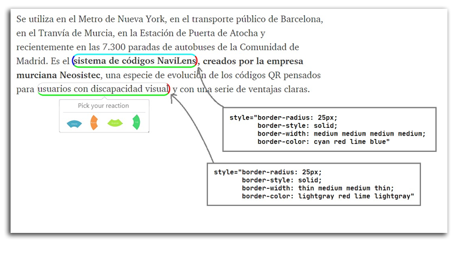

# Yawas-Thinktwise

This is an adaptation of the original Yawas extension.

The aim is to allow user to highlight and assign up to 4 different 'categories' to the highlighted text. The meaning of this categories is up to you (in our case wie will use them for som NLP analisys).

The actual combination of the for categories results into 2^4=16 different posibilities. In order to visually display such a big variety of information, we opted to only colour the borders of the highlighted text (please see picture 1)

As a vehicle for the user to assign/unassign categories to a highlighted text, we used a *popover* library called **tippy** (https://kabbouchi.github.io/)

Here you can see **tippy** and **Yawas-Thinktwise** in action.

# Original Yawas readme.md:
Yawas (Yet Another Web Annotation System) is a browser extension to highlight web pages and PDF documents.
It works both for Chrome and Firefox.

You can clone this repository and install the extension locally.

You can also download it directly for [Chrome](https://chrome.google.com/webstore/detail/yawas-web-and-pdf-highlig/kjlghdmljfgngjdpeaiogebkiilpiimk?hl=en) or [Firefox](https://addons.mozilla.org/en-US/firefox/addon/yawas-web-and-pdf-highlighter/)

# Donate

