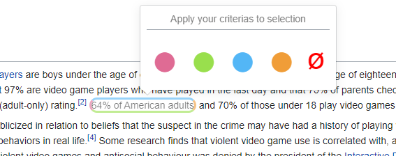

# Hipoint, the smart highlighter 

The aim is to allow user to highlight and assign up to 4 different 'categories' to the highlighted text. The actual combination of this 4 categories results into 2^4 = 16 different posibilities. In order to visually display such a variety of posible combinations, we opted to colour the borders of the highlighted text (please see picture 1). Each side (top, right, bottom, left) has a color (on/off). If the color is off, that border will be painted in "thin gray". Otherwise, will be painted in "thick YELLOW/RED/BLUE/GREEN"

As a vehicle for the user to assign/unassign categories to a highlighted text, we used a *popover* library called **tippy** (https://kabbouchi.github.io/)

Here you can see **tippy** and **Hipointer** in action.

